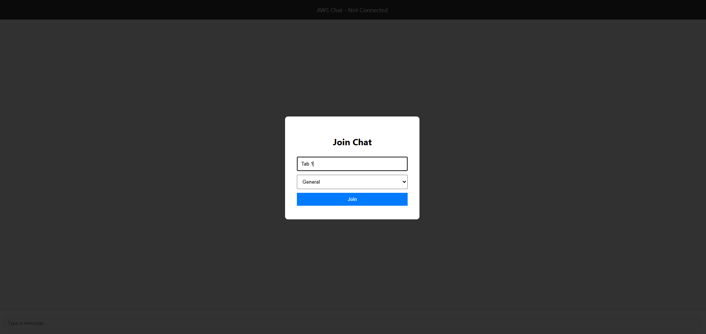
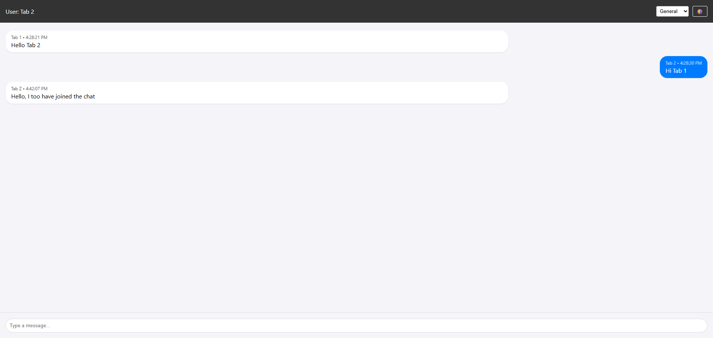
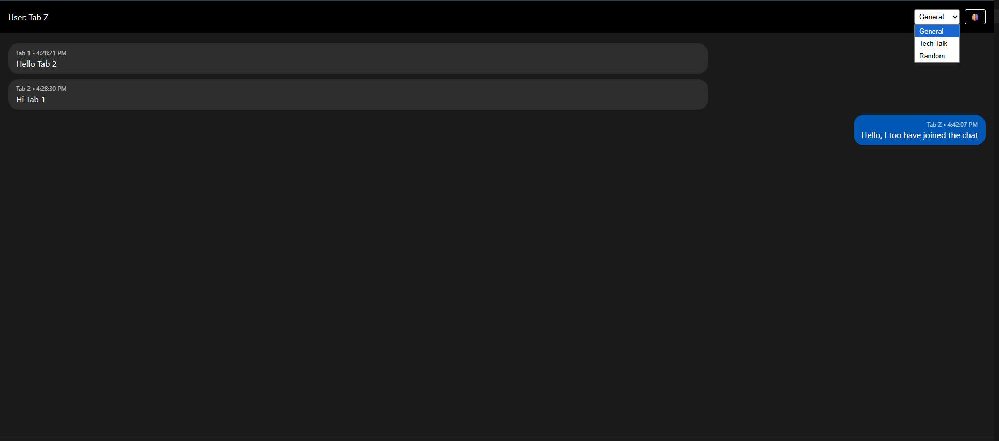
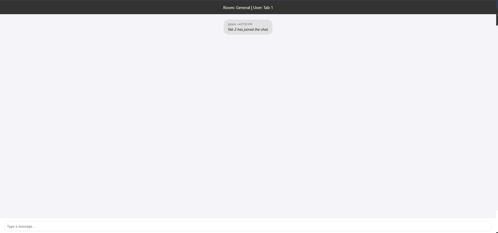
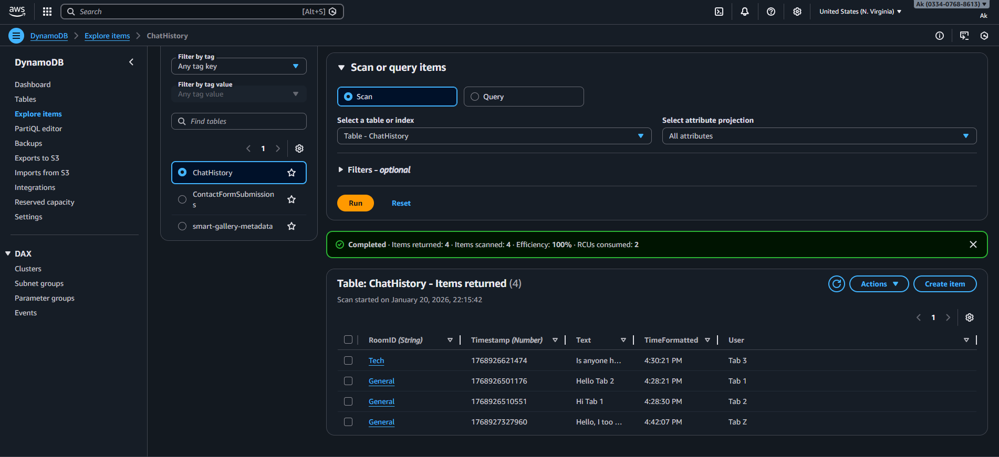
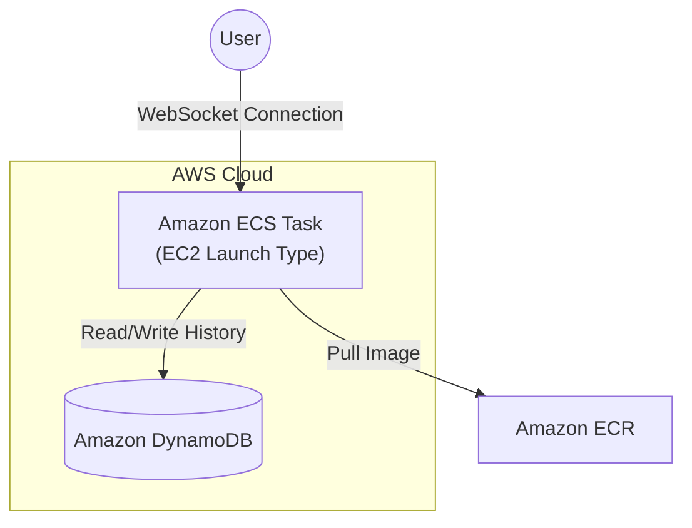

# 💬 AWS Cloud Chat — Real-Time Containerized Application

**A stateful, real-time chat application orchestrated on Amazon ECS and persisted via DynamoDB.**

This project demonstrates how to deploy **stateful** applications (WebSockets) on AWS using Docker containers, managing the infrastructure via CLI, and integrating serverless storage for message persistence.

---

## 📸 Screenshots

### 1. The Experience
| Login Screen | Chat Interface (Light) | Chat Interface (Dark) |
| :---: | :---: | :---: |
|  |  |  |

### 2. Under the Hood
| Initial State (Empty) | Database Persistence (DynamoDB) |
| :---: | :---: |
|  |  |

---

## 🏗️ Architecture

Unlike standard "stateless" REST APIs, this application requires a persistent connection between the client and server.



### 🧠 Key Engineering Decisions

* **Compute: Amazon ECS (EC2 Launch Type)**
* *Why:* Chosen over AWS Fargate to maximize **Free Tier** eligibility. By scheduling tasks on a `t3.micro` instance, I avoid the per-minute billing of serverless containers while still benefiting from ECS orchestration.


* **Protocol: WebSockets (Socket.io)**
* *Why:* Enables bi-directional, real-time communication. Unlike HTTP polling, this reduces overhead and provides instant feedback for typing indicators and messaging.


* **Database: Amazon DynamoDB**
* *Why:* A NoSQL key-value store was selected for its single-digit millisecond latency. Messages are stored with `RoomID` as the Partition Key and `Timestamp` as the Sort Key, allowing for efficient queries of chat history.


* **Security: IAM Roles**
* *Why:* No AWS Access Keys are hardcoded in the container. The ECS Task assumes an **IAM Role** (`EcsDynamoDBTaskRole`) to securely write to the database.


---

## 🚀 Features

* **🟢 Real-Time Messaging:** Instant delivery to all users in a room.
* **💾 Message Persistence:** Chat history is saved to DynamoDB and reloaded when you rejoin.
* **🌓 Dark/Light Mode:** Dynamic theme switching using CSS variables.
* **👥 Room Isolation:** Users in "Tech" cannot see messages from "General".
* **👀 Typing Indicators:** Visual feedback when other users are typing.
* **🐳 Containerized:** Fully portable Docker image stored in Amazon ECR.

---

## 🛠️ Tech Stack

* **Cloud Provider:** AWS
* **Orchestration:** Elastic Container Service (ECS)
* **Compute:** EC2 (Amazon Linux 2/2023)
* **Container Registry:** Amazon ECR
* **Database:** DynamoDB
* **Backend:** Node.js, Express, Socket.io
* **Frontend:** HTML5, CSS3 (Variables), Vanilla JS

---

## 📂 Repository Structure

```text
aws-socket-chat/
├── Dockerfile              # Multi-stage build for Node.js
├── server.js               # Backend logic (Socket.io + DynamoDB SDK)
├── public/                 # Static frontend assets
│   ├── index.html          # UI Logic (Themes, Rooms, Chat)
│   └── ...
├── task-def.json           # ECS Task Definition (IaC)
└── user-data.sh            # EC2 Bootstrapping script for ECS Agent

```

---

## ⚙️ How to Run (Reproduction Steps)

### Prerequisites

* AWS CLI installed and configured.
* Docker Desktop installed.

### Phase 1: Build & Push

```bash
# Login to AWS ECR
aws ecr get-login-password --region us-east-1 | docker login --username AWS --password-stdin <YOUR_ACCOUNT_ID>.dkr.ecr.us-east-1.amazonaws.com

# Build and Tag
docker build -t chat-repo .
docker tag chat-repo:latest <YOUR_ACCOUNT_ID>[.dkr.ecr.us-east-1.amazonaws.com/chat-repo:latest](https://.dkr.ecr.us-east-1.amazonaws.com/chat-repo:latest)

# Push to Cloud
docker push <YOUR_ACCOUNT_ID>[.dkr.ecr.us-east-1.amazonaws.com/chat-repo:latest](https://.dkr.ecr.us-east-1.amazonaws.com/chat-repo:latest)

```

### Phase 2: Deploy Infrastructure

```bash
# Create Cluster
aws ecs create-cluster --cluster-name chat-cluster

# Register Task (Links Container to IAM Role)
aws ecs register-task-definition --cli-input-json file://task-def.json

# Launch Service
aws ecs create-service --cluster chat-cluster --service-name chat-service --task-definition chat-task-v2 --desired-count 1 --launch-type EC2

```

---

## 🔮 Future Enhancements

1. **Application Load Balancer (ALB):** Add an ALB with "Sticky Sessions" to support scaling to multiple containers.
2. **HTTPS/SSL:** Secure the WebSocket connection using AWS Certificate Manager (ACM).
3. **Authentication:** Integrate Amazon Cognito to replace the simple username prompt.

---

**Author:** Aryan Kapoor
*Built as part of the AWS Cloud Portfolio Journey (Free Tier Edition)*
